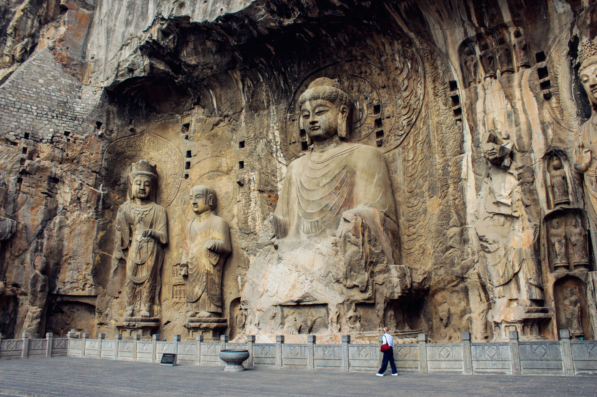

# Quicksviewer: An LMM for Efficient Video Understanding via Reinforced Compression of Video Cubes

[](CODE_LICENSE)
[](MODEL_LICENSE)
[](https://www.python.org/downloads/release/python-3100/)

[arXiv](https://arxiv.org/pdf/2504.15270v1) / [Code](https://github.com/quicksviewer/quicksviewer) / [Models](https://huggingface.co/qijithu/quicksviewer) / [Project](https://quicksviewer.github.io/)

## Introduction

Quicksviewer is a Large Multimodal Model (LMM) that can efficiently understand videos with extensive frames as input. Quicksviewer adopts a new perceiving paradigm that partitions a video of nonuniform density into varying cubes using Gumbel
Softmax, followed by a unified resampling for each cube to achieve dynamic online compression. We train two versions of models (i.e., Quicksviewer, and Quicksviewer-Llama3.1) from language backbones through three progressive stages to build video LMMs, each stage incorporating lengthy videos on average of 420s/1fps thanks to the perceiving efficiency. Our models achieves remarkable performance on standard video understanding benchmarks, and the intermediate segmentations generated by our model can also help for analyzing continuous events in videos.
Quicksviewer also preserve the single/multi-image(s) understanding capabilities, as well as the in-context learning capabilities.


## News

- \[2025/4/28\] As of April 28, 2025, Code ([#training](#sec_training), [#evaluations](#sec_evaluations), [#inference](#sec_inference)) is released.
- \[2025/4/28\] As of April 21, 2025, Paper is on [Arxiv](https://arxiv.org/pdf/2504.15270v1)!


## Examples

### Video captioning

https://github.com/user-attachments/assets/fe55fb44-9cee-48e9-9aaa-468c602a1012

Prompt: Please describe the content of this video in detail.

Model: The video starts with a remote-controlled car being assembled by a person, who connects the wires to the car. After the assembly is complete, the car is shown driving on various terrains, including grass, dirt roads, and snowy fields. The car navigates through these different environments smoothly, showcasing its versatility. The camera then captures the car driving on a frozen lake, where it creates ripples and splashes in the water as it moves forward. The car continues to drive around the lake, demonstrating its ability to handle challenging conditions. The video ends with the person who assembled the car walking away from the scene, suggesting that the car has been successfully tested and is ready for use. Overall, the video showcases the remote-controlled car's capabilities, highlighting its ability to navigate different types of terrain and challenging conditions.

### Single-image understanding



Prompt: Where is it located?

Model: This is the Longmen Grottoes, located in Luoyang, Henan, China.

### Multi-image reasoning


Prompt: What are the species of the birds, and which one inhabits the red area marked in the first
map?

Model: The first bird is a South American ostrich, the second is an African ostrich, and
the third is a cassowary. The African ostrich inhabits the red area marked in the first map.

## Installation

### Using pip
1.  Install [Anaconda Distribution](https://www.anaconda.com/download).
2.  Install the necessary Python packages in the environment.

    ```bash
    pip install -r requirements.txt
    ```

### Using Docker
1.  Using our provided [Dockerfile](Dockerfile) to build a docker image.
2.  Launch a containter using the docker image created in last step, which has all dependencies you may need.


<a id="sec_training"></a>
## Training

Quicksviewer training contains three steps, and we have provided standard implementations of the hyperparameters for reproducing our models. Please check out the [scripts](scripts) folder.

### Step-1: Alignment

We utilize both interleaved and captioning **image-text** corpuses,
and **video-text** captioning corpus to train our models for multimodal alignment. The datasets consist of *OBELICS*, *LCS558K*, *FineVideo*, and *ANetCaptions*.


```bash
bash scripts/stage1.sh
```

and the trained models will be saved to `output/quicksviewer-s1`.


### Step-2: Pre-training

We use large-scale **image-text** data with additional **video-text** data to pre-train our models, building fundamental visual understanding abilities. The data consist of a subset of 2.99M samples from *LLaVA-OneVision-SingleImage*, a sampled subset of 75K video QAs from *FineVideo*, and 38K captioning pairs from *ShareGPT4Video*.


```bash
bash scripts/stage2.sh
```

and the trained models will be saved to `output/quicksviewer-s2`.


### Step-3: Supervised fine-tuning

We primarily leverage extensive **video-text** paired corpus to
train our models in this stage, enabling robust video understanding capabilities. We primarily utilize
a subset of 476K samples from *VideoChat2-IT*, and a subset of
79K samples from *ShareGPTVideo* . To enhance adaptation
to long video scenarios, we further integrate 5K samples from *MovieChat*, and
39K samples derived by *LongVILA*. The
**image-text** corpus incorporates a sampled subset of 100K 
samples from *LLaVA-OneVision-MultiImages*.

```bash
bash scripts/stage3.sh
```

and the trained models will be saved to `output/quicksviewer-s3`.


<a id="sec_evaluations"></a>
## Evaluations

We have implemented all evaluation benchmarks into one bash script, by using task-specific command for particular evaluation. See [run_eval](quicksviewer/eval/run_eval.sh) for details.

For example, run evaluation on the benchmark of `Video-MME` for the trained checkpoint `checkpoints/quicksviewer-s3/checkpoint-10000`, using `420` input frames and `1` FPS:

```bash
bash run_eval.sh videomme checkpoints/quicksviewer-s3/checkpoint-10000 420 1
```

it will launch a evaluation on 8 GPUs for parallel evaluation, and save the **metrics** and **results** in `output` directory.


<a id="sec_inference"></a>
## Inference

We provide `cli.py` for quick inference with user prompts and videos/images.

```bash
# image description
export PYTHONPATH=/path/to/quicksviewer

python quicksviewer/serve/cli.py \
    --model-path checkpoints/quicksviewer-s3/checkpoint-10000 \
    --version qwen2 \
    --context playground/demo/examples/tokyo_people.mp4 \
    --video_nframes 420 \
    --video_fps 1 \
    --vpm 0 \
    --llm-device 1
```


<a id="sec_deployment"></a>
## Deployment

We provide `demo.py` based on the gradio framework for quick inference with user prompts and videos/images.


#### With CLI

```bash
export PYTHONPATH=/path/to/quicksviewer

python playground/demo.py \
    --model-path checkpoints/quicksviewer-s3/checkpoint-10000 \
    --version qwen2 \
    --video_nframes 420 \
    --video_fps 1 \
    --vpm 0 \
    --llm-device 1
```


## Checkpoints

We release the following models:

- Quicksviewer
  + stage1-ckpt
  + stage2-ckpt
  + stage3-ckpt
- Quicksviewer-Llama3.1
  + stage1-ckpt
  + stage2-ckpt
  + stage3-ckpt

## License

- The code is released under the Apache 2.0 license as found in the [LICENSE](./LICENSE) file.
- The pretrained weights are released under the [CC-BY-NC-SA-4.0 license](https://creativecommons.org/licenses/by-nc-sa/4.0/deed.en).
- The service is a research preview, subject to the model [License](https://github.com/QwenLM/Qwen/blob/main/LICENSE) of Qwen or [License](https://github.com/facebookresearch/llama/blob/main/MODEL_CARD.md) of LLaMA. Please contact us if you find any potential violation.


## Citations

```
@article{qi2025lmm,
  title={Quicksviewer: An LMM for Efficient Video Understanding via Reinforced Compression of Video Cubes},
  author={Qi, Ji and Yao, Yuan and Bai, Yushi and Xu, Bin and Li, Juanzi and Liu, Zhiyuan and Chua, Tat-Seng},
  journal={arXiv preprint arXiv:2504.15270},
  year={2025}
}
```


# Acknowledgement

We are grateful for the following awesome projects our work arising from:

- [LLaVA](https://github.com/haotian-liu/LLaVA): Large Language and Vision Assistant
- [MiniCPM-V](https://github.com/OpenBMB/MiniCPM-o): A GPT-4o Level MLLM for Vision, Speech and Multimodal Live Streaming on Your Phone
- [VILA](https://github.com/NVlabs/VILA): VILA: Optimized Vision Language Models
- [LongVU](https://github.com/Vision-CAIR/LongVU): LongVU: Spatiotemporal Adaptive Compression for Long Video-Language Understanding
- [Qwen](https://github.com/QwenLM/Qwen2.5): Qwen2.5 Technical Report
- [LLaMA](https://github.com/meta-llama/llama3): The Llama Family

